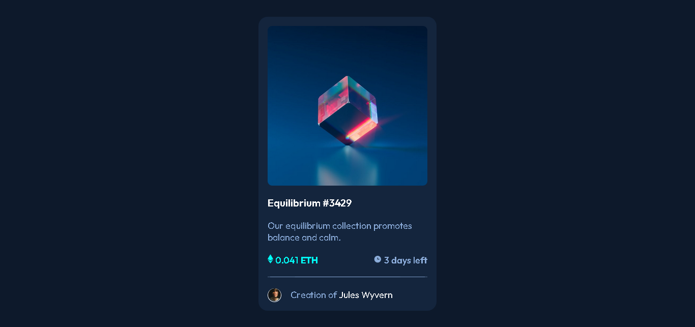

# nft-preview-card-component
This is a solution to the [NFT preview card component challenge on Frontend Mentor](https://www.frontendmentor.io/challenges/nft-preview-card-component-SbdUL_w0U).

## Table of contents
- [Overview](#overview)
  - [The challenge](#the-challenge)
  - [Screenshot](#screenshot)
  - [Links](#links)
- [My process](#my-process)
  - [Built with](#built-with)
  - [What I learned](#what-i-learned)
  - [Useful resources](#useful-resources)
- [About me](#about-me)

## Overview

### The challenge
Users should be able to:
- View the optimal layout depending on their device's screen size.
- See hover states for interactive elements.

### Screenshot

### Links
- [Challenge's website](https://www.frontendmentor.io/challenges/nft-preview-card-component-SbdUL_w0U)
- [Live solution page](https://stibojeda.github.io/nft-preview-card-component/)
- [Code repository](https://github.com/stibojeda/nft-preview-card-component)

## My process

### Built with
- Semantic HTML5 markup
- CSS custom properties
- Flexbox

### What I learned
I learned a lot about the responsive design in CSS with flexbox. Also, this was a great oportunity to practice my skills.

### Useful resources
- [MDN documentation](https://developer.mozilla.org/en-US/docs/Learn/CSS/CSS_layout/Flexbox)
- [Free Code Camp](https://www.youtube.com/watch?v=XqFR2lqBYPs)
- [SoloLearn](https://www.sololearn.com/learning/1023)

## About me
- Portfolio: [Stiven Ojeda](https://stibojeda.github.io)
- Linkedin: [Stiven Ojeda](https://www.linkedin.com/in/stiven-ojeda-090a3924a)
